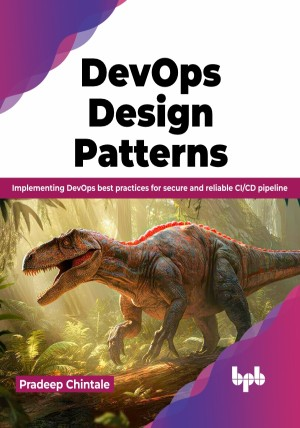

# DevOps Design Pattern

DevOps design, architecture and its implementations with best practices

This is the repository for [DevOps Design Pattern
](https://bpbonline.com/products/devops-design-pattern?_pos=1&_sid=d818d0acf&_ss=r&variant=43095252828360),published by BPB Publications.

## About the Book
DevOps design patterns encompass a set of best practices aimed at revolutionizing the software development lifecycle. It introduces a collaborative and streamlined approach to bring together different aspects of development, testing, deployment, and operations. At its core, DevOps seeks to break down traditional silos between these functions, fostering a culture of cooperation and continuous communication among teams. This interconnectivity enables faster, higher-quality software delivery by eliminating bottlenecks.       

DevOps best practices offer significant benefits to DevOps engineers, enhancing their effectiveness and efficiency. Examine best practices for version control and dynamic environments closely, learn how to "build once, deploy many," and master the art of continuous integration and delivery (CI/CD), reducing manual intervention and minimizing errors. Each chapter equips you with actionable insights, guiding you through automated testing, robust monitoring, and effective rollback strategies. You will confidently tap into the power of Infrastructure as Code (IaC) and DevSecOps methodologies, ensuring secure and scalable software delivery.

Overall, DevOps best practices enable DevOps engineers to deliver high-quality, scalable, and secure software in a more streamlined and collaborative environment. 

## What You Will Learn
• Apply DevOps design patterns to optimize system architecture and performance.

• Implement DevOps best practices for efficient software development.

• Establish robust and scalable CI/CD processes with security considerations.

• Effectively troubleshoot issues and ensure reliable and resilient software.

• Seamlessly integrate security practices into the entire software development lifecycle, from coding to deployment.
